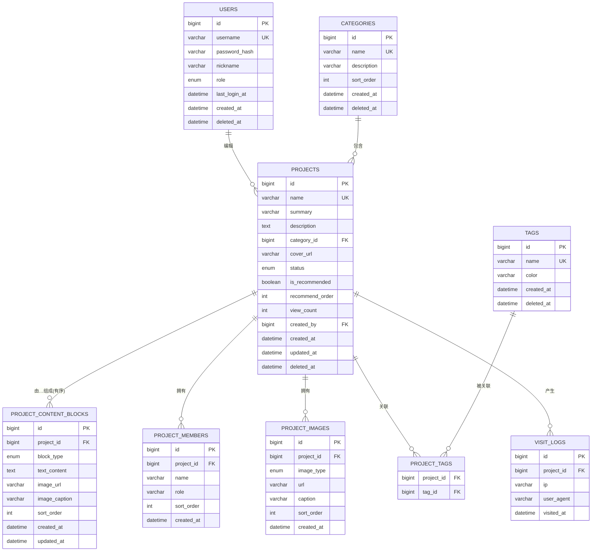

# 数据库设计 —— 大连理工大学实训基地优秀项目展示系统

> 版本 V1.0 ｜ 2026-09-01 ｜ 对应评审：9 月 24 日数据库评审
> MySQL 8.0 ｜ InnoDB ｜ utf8mb4 ｜ 命名：小写 + 下划线

---

## 1. 设计原则

1. **内容块模型**：项目详情不设计成几十个零散字段，而是"有序内容块"（小节/段落/图片）。管理员实际是在编辑一篇"项目作品文章"。
2. **一项目一作品**：30 个项目按"30 件作品"建模，内容表达力优先。
3. **软删除**：所有业务表带 `deleted_at`，项目删除可恢复（二期实现恢复）。
4. **乐观扩展**：一期 MySQL 即可，二期 Redis 缓存只读热数据（推荐、首页、浏览量聚合），不改变表结构。
5. **状态驱动**：项目通过 `status` 控制前后台可见性。

---

## 2. 数据库清单

| 库 | 用途 |
| --- | --- |
| `project_showcase` | 业务库（本项目全部表） |
| （二期）Redis db0 | 缓存：首页推荐、热门前三、浏览量计数、搜索热词 |

---

## 3. E-R 图

**E-R 说明（文字版）**：
- 管理员（USERS）可以创建/编辑多个项目（PROJECTS）。
- 每个项目**必须**属于一个分类（CATEGORIES，`category_id` 非空）。
- 一个项目与多个标签（TAGS）为**多对多**，通过 `PROJECT_TAGS` 关联表实现。
- 一个项目拥有多个内容块（PROJECT_CONTENT_BLOCKS），块按 `sort_order` 有序排列，构成详情文章。
- 一个项目拥有多个成员（PROJECT_MEMBERS）和多个图片（PROJECT_IMAGES）。
- 一个项目产生多条访问日志（VISIT_LOGS）；同时 `projects.view_count` 冗余累计数用于快速展示。

---

## 4. 表结构详细设计

### 4.1 `users` 管理员用户表

| 字段 | 类型 | 允许空 | 默认 | 说明 |
| --- | --- | --- | --- | --- |
| id | BIGINT UNSIGNED AUTO_INCREMENT | 否 | - | 主键 |
| username | VARCHAR(50) | 否 | - | 登录名，唯一 |
| password_hash | VARCHAR(100) | 否 | - | bcrypt 哈希 |
| nickname | VARCHAR(50) | 是 | NULL | 显示名 |
| role | ENUM('admin','editor') | 否 | 'admin' | 一期仅 admin，editor 预留 |
| last_login_at | DATETIME | 是 | NULL | 最近登录时间 |
| created_at | DATETIME | 否 | CURRENT_TIMESTAMP | 创建时间 |
| deleted_at | DATETIME | 是 | NULL | 软删除标记 |

> 索引：`username`（唯一）。初始化数据：admin / 加密密码（交付文档中标注默认密码并提示首登修改）。

### 4.2 `categories` 分类表

| 字段 | 类型 | 允许空 | 默认 | 说明 |
| --- | --- | --- | --- | --- |
| id | BIGINT UNSIGNED AUTO_INCREMENT | 否 | - | 主键 |
| name | VARCHAR(50) | 否 | - | 分类名，唯一 |
| description | VARCHAR(255) | 是 | NULL | 描述 |
| sort_order | INT | 否 | 0 | 排序，越小越靠前 |
| created_at | DATETIME | 否 | CURRENT_TIMESTAMP | 创建时间 |
| deleted_at | DATETIME | 是 | NULL | 软删除标记 |

> 索引：`name`（唯一）。示例：开发类 / 前端类 / 嵌入式类 / 人工智能类 / 综合应用类。

### 4.3 `projects` 项目主表

| 字段 | 类型 | 允许空 | 默认 | 说明 |
| --- | --- | --- | --- | --- |
| id | BIGINT UNSIGNED AUTO_INCREMENT | 否 | - | 主键 |
| name | VARCHAR(100) | 否 | - | 项目名，唯一 |
| summary | VARCHAR(255) | 否 | - | 一句话介绍（卡片/搜索用） |
| description | TEXT | 是 | NULL | 简介补充（保留，兼容过渡） |
| category_id | BIGINT UNSIGNED | 否 | - | 所属分类，FK→categories.id |
| cover_url | VARCHAR(500) | 是 | NULL | 封面图 URL |
| status | ENUM('draft','published','archived') | 否 | 'draft' | 草稿/上架/下架。一期用 published=上架，draft/archived=下架隐藏 |
| is_recommended | TINYINT(1) | 否 | 0 | 是否推荐 |
| recommend_order | INT | 否 | 0 | 推荐排序，越小越靠前 |
| view_count | INT UNSIGNED | 否 | 0 | 浏览量（冗余累计，供快速展示） |
| created_by | BIGINT UNSIGNED | 否 | - | 创建人，FK→users.id |
| created_at | DATETIME | 否 | CURRENT_TIMESTAMP | 创建时间 |
| updated_at | DATETIME | 否 | CURRENT_TIMESTAMP ON UPDATE | 更新时间 |
| deleted_at | DATETIME | 是 | NULL | 软删除标记 |

> 索引：
> - `category_id`（普通）
> - `status`（普通，前台过滤上架）
> - `is_recommended, recommend_order`（联合，推荐流）
> - `name`（唯一）
> - `created_at`（列表排序）
> - 全文检索不做，搜索用 `name/summary` LIKE + 标签 join（30 项目规模足够）。

### 4.4 `tags` 标签表

| 字段 | 类型 | 允许空 | 默认 | 说明 |
| --- | --- | --- | --- | --- |
| id | BIGINT UNSIGNED AUTO_INCREMENT | 否 | - | 主键 |
| name | VARCHAR(30) | 否 | - | 标签名，唯一（如 Go、AST、VS Code） |
| color | VARCHAR(20) | 是 | NULL | 前台 chip 颜色（可选） |
| created_at | DATETIME | 否 | CURRENT_TIMESTAMP | 创建时间 |
| deleted_at | DATETIME | 是 | NULL | 软删除标记 |

### 4.5 `project_tags` 项目-标签关联表

| 字段 | 类型 | 允许空 | 默认 | 说明 |
| --- | --- | --- | --- | --- |
| project_id | BIGINT UNSIGNED | 否 | - | FK→projects.id |
| tag_id | BIGINT UNSIGNED | 否 | - | FK→tags.id |

> 联合主键 `(project_id, tag_id)`；索引：`tag_id`（按标签反查项目）。删除项目/标签时级联清理（外键 `ON DELETE CASCADE`）。

### 4.6 `project_content_blocks` 项目内容块表（★ 核心表）

| 字段 | 类型 | 允许空 | 默认 | 说明 |
| --- | --- | --- | --- | --- |
| id | BIGINT UNSIGNED AUTO_INCREMENT | 否 | - | 主键 |
| project_id | BIGINT UNSIGNED | 否 | - | FK→projects.id |
| block_type | ENUM('heading','paragraph','image') | 否 | - | 小节标题/段落/图片（预留 list、quote、code、video） |
| text_content | TEXT | 是 | NULL | 文本内容（heading/paragraph 使用） |
| image_url | VARCHAR(500) | 是 | NULL | 图片 URL（image 类型使用） |
| image_caption | VARCHAR(255) | 是 | NULL | 图片说明（image 类型使用） |
| sort_order | INT | 否 | 0 | 块顺序，越小越靠前（渲染核心） |
| created_at | DATETIME | 否 | CURRENT_TIMESTAMP | 创建时间 |
| updated_at | DATETIME | 否 | CURRENT_TIMESTAMP ON UPDATE | 更新时间 |

> 索引：`(project_id, sort_order)` 联合索引（加载详情一次性按序取）。保存策略：编辑保存时事务内**全量替换**该项目的块集合（先删后插），保证顺序一致。

### 4.7 `project_members` 项目成员表

| 字段 | 类型 | 允许空 | 默认 | 说明 |
| --- | --- | --- | --- | --- |
| id | BIGINT UNSIGNED AUTO_INCREMENT | 否 | - | 主键 |
| project_id | BIGINT UNSIGNED | 否 | - | FK→projects.id |
| name | VARCHAR(50) | 否 | - | 成员姓名 |
| role | VARCHAR(100) | 是 | NULL | 角色/职责（如"后端开发"） |
| sort_order | INT | 否 | 0 | 展示顺序 |
| created_at | DATETIME | 否 | CURRENT_TIMESTAMP | 创建时间 |

### 4.8 `project_images` 项目图片表

| 字段 | 类型 | 允许空 | 默认 | 说明 |
| --- | --- | --- | --- | --- |
| id | BIGINT UNSIGNED AUTO_INCREMENT | 否 | - | 主键 |
| project_id | BIGINT UNSIGNED | 否 | - | FK→projects.id |
| image_type | ENUM('cover','screenshot','other') | 否 | 'screenshot' | 用途：封面/截图/其他 |
| url | VARCHAR(500) | 否 | - | 图片 URL |
| caption | VARCHAR(255) | 是 | NULL | 说明 |
| sort_order | INT | 否 | 0 | 展示顺序 |
| created_at | DATETIME | 否 | CURRENT_TIMESTAMP | 创建时间 |

> 说明：封面同时冗余在 `projects.cover_url`（列表页无需 join）。`image_type='cover'` 的记录即为封面对应文件；内容块中的图片块也可引用本表记录或独立上传。

### 4.9 `visit_logs` 访问日志表（一期可选）

| 字段 | 类型 | 允许空 | 默认 | 说明 |
| --- | --- | --- | --- | --- |
| id | BIGINT UNSIGNED AUTO_INCREMENT | 否 | - | 主键 |
| project_id | BIGINT UNSIGNED | 否 | - | FK→projects.id |
| ip | VARCHAR(45) | 是 | NULL | 访客 IP（含 IPv6） |
| user_agent | VARCHAR(255) | 是 | NULL | UA |
| visited_at | DATETIME | 否 | CURRENT_TIMESTAMP | 访问时间 |

> 一期若只想展示浏览量，可只使用 `projects.view_count`，`visit_logs` 表延后建。二者一致性：进入详情时事务内 `view_count+1`，同时（可选）插入日志。

---

## 5. 索引汇总

| 表 | 索引 | 用途 |
| --- | --- | --- |
| users | UNIQUE(username) | 登录查询 |
| categories | UNIQUE(name) | 唯一性 |
| projects | UNIQUE(name) | 项目名唯一 |
| projects | INDEX(category_id) | 按分类筛选 |
| projects | INDEX(status) | 上架过滤 |
| projects | INDEX(is_recommended, recommend_order) | 推荐流 |
| projects | INDEX(created_at) | 最新排序 |
| project_tags | PK(project_id, tag_id) | 关联唯一 |
| project_tags | INDEX(tag_id) | 标签反查 |
| project_content_blocks | INDEX(project_id, sort_order) | 详情顺序加载 |
| project_images | INDEX(project_id) | 图片列表 |
| project_members | INDEX(project_id) | 成员列表 |
| visit_logs | INDEX(project_id, visited_at) | 访问统计 |

---

## 6. 数据示例

**示例项目：MyGoVoice**

- `projects.name = 'MyGoVoice'`；`summary = 'A lightweight Go code structure announcer for VS Code.'`
- `category_id` → 开发类；`is_recommended = 1`；`recommend_order = 1`；`status = 'published'`
- 标签：Go、AST、VS Code（3 行 project_tags）
- 成员：张三(后端开发)、李四(前端开发)
- 内容块（按 sort_order）：
  1. heading「项目介绍」
  2. paragraph「MyGoVoice 是一款轻量级 VS Code 插件，用 Go 解析代码结构并语音播报……」
  3. image（核心界面截图，caption「核心界面」）
  4. heading「功能特性」
  5. paragraph「……」
  6. image（结构树截图）

---

## 7. 与二期（Redis/Docker）的衔接

| 项 | 设计预留 |
| --- | --- |
| Redis 缓存 | 缓存 key：`rec:home`（首页推荐项目）、`proj:{id}`（项目详情，失效于编辑/上下架）、`rank:hot`（浏览最多）、`search:hot`（热词）。一期先直连 MySQL，二期加缓存层不改表 |
| 浏览量去抖 | 二期：Redis 计数 + 定时落库，替代直接 `view_count+1` |
| Docker | 一期提供 `docker-compose.yml`（mysql + 后端 + 前端静态资源 nginx）骨架，二期完善 |
| 文件存储 | 一期本地静态目录 `/uploads`；二期接阿里云 OSS，表内 URL 字段不变，仅换前缀 |

---

## 8. 评审关注点（自查清单）

- [ ] 内容块表是否满足"文章式编排"（类型、顺序、增删改）？
- [ ] 搜索命中字段：name / summary / tags / content_block.text_content 是否足够？
- [ ] 分类与标签是否重叠？是否可合并（评审后定）？
- [ ] 软删除 + 唯一约束（name）删除后重名问题：软删后唯一索引会阻止重建同名 → 待确认用 `deleted_at` 参与唯一或改为非唯一。
- [ ] 浏览量一致性（字段冗余 vs 日志表）取舍待确认。
