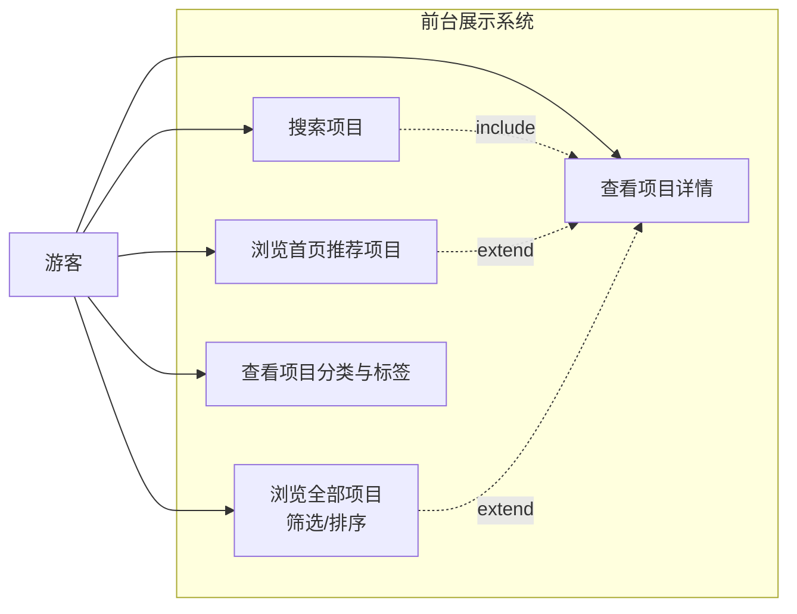
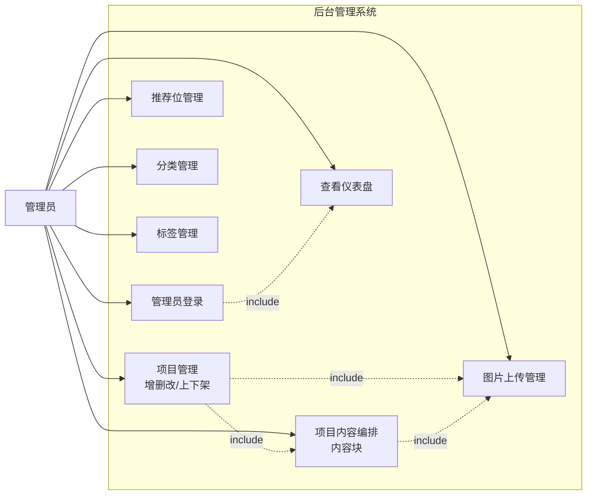
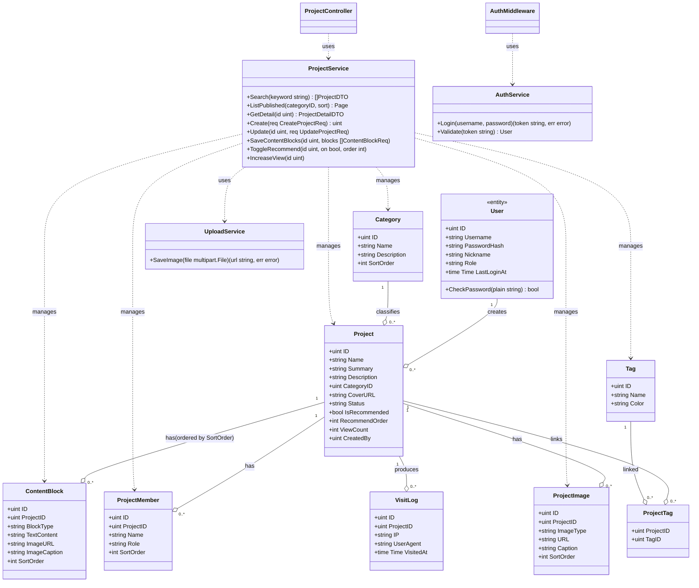
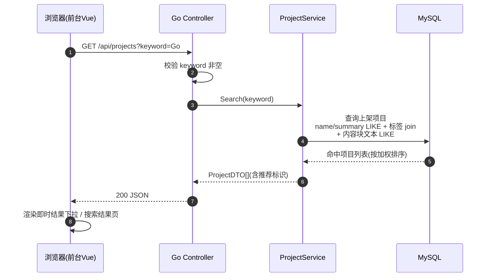
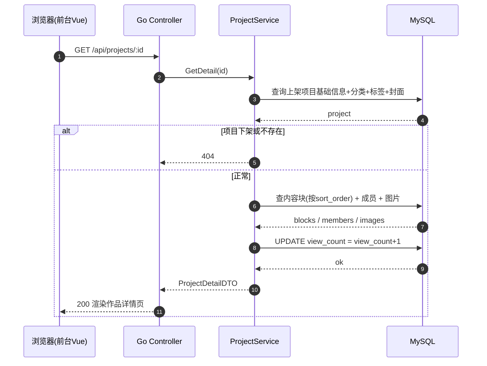
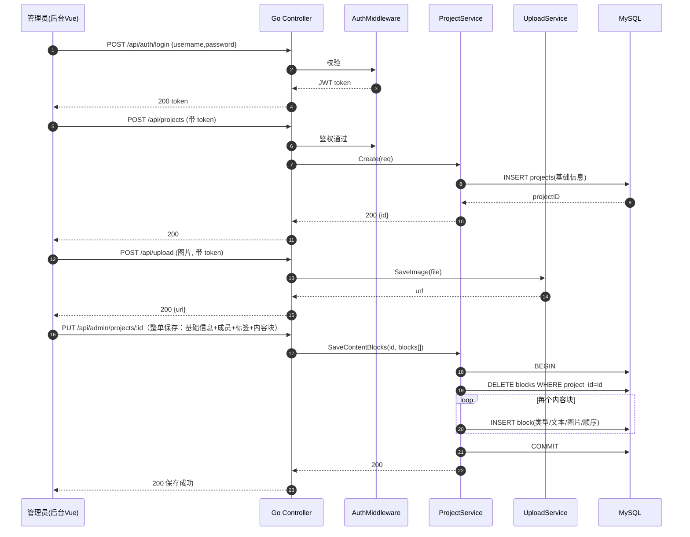
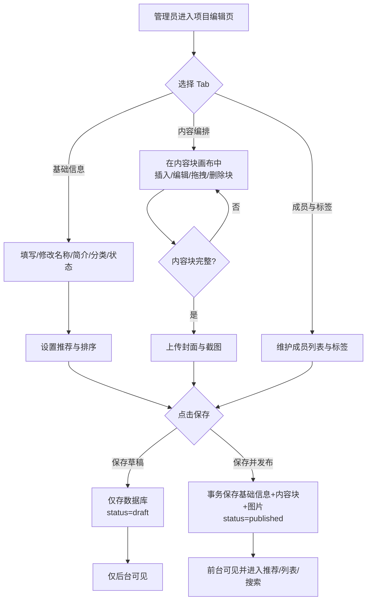
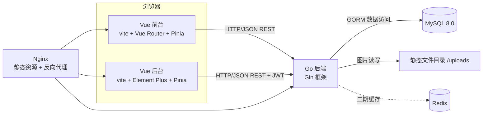
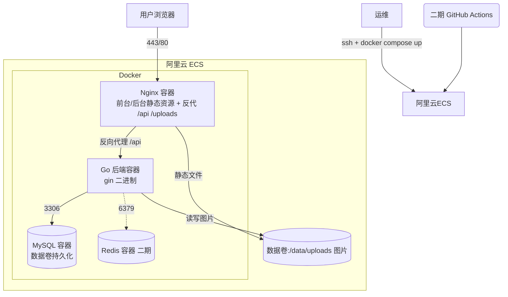

# UML 设计 —— 大连理工大学实训基地优秀项目展示系统

> 版本 V1.0 ｜ 2026-09-01 ｜ 对应评审：9 月 24 日概要设计评审
> 图均可用 Mermaid 渲染（GitHub/Typora/VSCode 插件），也可导出为图片。

---

## 1. 用例图

### 1.1 前台用例图（游客）

### 1.2 后台用例图（管理员）

> 说明：UML 标准用例图通常用 `usecase` 图元，上图为便于阅读的流程式表达。正式评审稿可转为标准用例图（角色 Actor + 椭圆用例 + 包含/扩展关系）。

---

## 2. 类图（后端领域模型）

> 分层说明：`Controller`（HTTP 路由/参数校验）→ `Service`（业务）→ `Repository`（数据访问，图中以实体关联示意）→ MySQL。DTO 用于隔离对外字段。

---

## 3. 时序图

### 3.1 搜索项目（前台）

### 3.2 查看项目详情（前台，含浏览量）

### 3.3 后台新建项目（含内容编排保存）

---

## 4. 活动图 —— 后台内容编排（核心流程）

---

## 5. 组件图（系统架构）

---

## 6. 部署图（二期：Docker + 阿里云）

**部署说明**：
- 前台/后台构建为静态资源，由 Nginx 容器服务并做路由回退（SPA history 模式）。
- `/api` 反代到 Go 容器；`/uploads` 直接由 Nginx 服务图片文件。
- MySQL 数据与上传图片挂载数据卷，容器重建不丢数据。
- 二期补充：HTTPS 证书、Redis 缓存、镜像仓库 + CI/CD。

---

## 7. 接口清单（REST 概览，供概要设计评审）

### 前台（公开）
| 方法 | 路径 | 说明 |
| --- | --- | --- |
| GET | `/api/home` | 首页聚合：推荐 + 分类 + 最新 |
| GET | `/api/projects` | 列表（keyword/分类/标签/排序/分页；关键词搜索走此接口） |
| GET | `/api/search/suggest?keyword=` | 搜索联想（轻量卡片，≤6） |
| GET | `/api/projects/:id` | 项目详情（blocks/members/tags/浏览量+1） |
| GET | `/api/categories` | 分类列表 |
| GET | `/api/tags` | 标签列表 |
| GET | `/uploads/*` | 图片静态服务（V1 本地） |

### 后台（`/api/admin/*` 需 JWT；登录公开）
| 方法 | 路径 | 说明 |
| --- | --- | --- |
| POST | `/api/auth/login` | 登录获取 token（公开） |
| GET | `/api/auth/me` | 当前登录用户 |
| GET | `/api/admin/overview` | 仪表盘统计 |
| GET/POST | `/api/admin/projects` | 项目列表 / 新建 |
| GET/PUT/DELETE | `/api/admin/projects/:id` | 编辑回显 / **整单保存** / 级联删除 |
| PUT | `/api/admin/projects/:id/status` | 上下架 / 转草稿 |
| PUT | `/api/admin/projects/:id/recommend` | 推荐位与排序 |
| GET/POST | `/api/admin/categories` · PUT/DELETE `/api/admin/categories/:id` | 分类管理 |
| GET/POST | `/api/admin/tags` · PUT/DELETE `/api/admin/tags/:id` | 标签管理 |
| POST | `/api/admin/upload` | 图片上传（multipart → `/uploads/...`） |

> 说明：后台**整单保存**指 `PUT /api/admin/projects/:id` 一次性提交基础信息 + 标签 + 成员 + 内容块，后端单事务内全量替换（无独立 content-blocks 接口）。

---

## 8. 统一约定

| 项 | 约定 |
| --- | --- |
| 返回格式 | `{ code: 0, message: "ok", data: {...} }`；非 0 为错误码 |
| 错误码 | 4xxxx 参数/业务，401xx 未登录，403xx 无权限，404xx 不存在，5xxxx 服务端 |
| 分页参数 | `page`、`page_size`（默认 20，≤100） |
| 时间格式 | `2006-01-02 15:04:05`（Go） |
| 排序 | 均支持 `sort=recommend|newest|views` |
