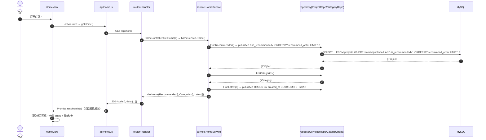
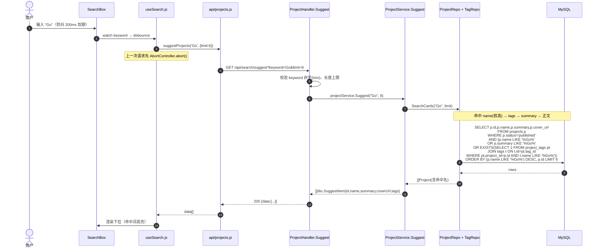
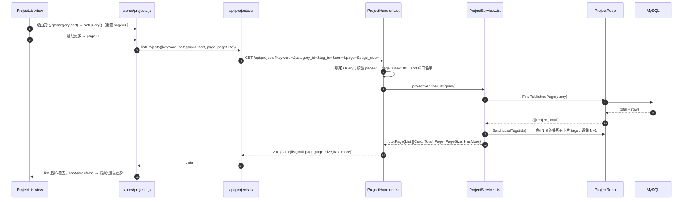
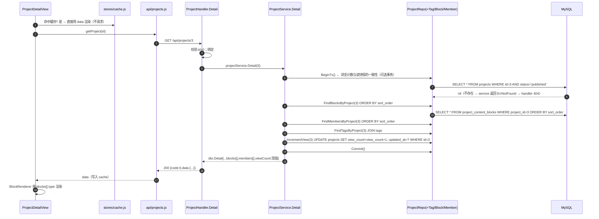
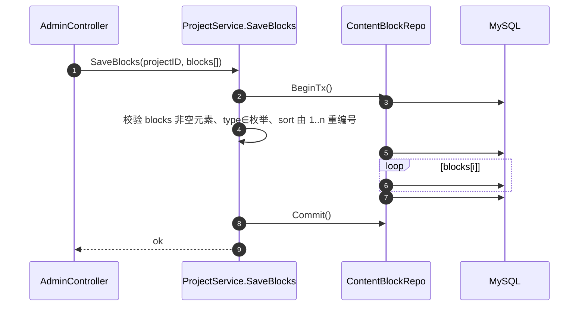

# 前后端 API 调用链 & 后端数据库调用链

> 版本：V1.0 ｜ 2026-09-04 ｜ 模型基准：新版/详版（`03-数据库设计.md`）；接口契约：`09-前台设计方案.md`
> 后端分层：`router → handler → service → repository → MySQL(model)`（CLAUDE.md / 02-基本架构）
> 范围：前台 4 大核心场景（首页 / 搜索联想 / 列表 / 详情）。后台 2 个补充场景（项目管理 / 内容块保存）给出 service 级调用链，展示事务写法。

---

## 0. 总览：一条请求要穿过哪些层

```
浏览器(Vue)
  view → store → components ──调用──▶ api/(axios)
                                          │ HTTP: 方法 + 路径 + 查询/请求体
                                          ▼
Go: router(Gin) ──▶ middleware(日志/CORS/可选鉴权)
                        │ 绑定+校验参数
                        ▼
                    handler ──▶ service（业务编排、事务）
                                     │
                                     ▼
                                 repository（唯一写 SQL 的地方）
                                     │ GORM
                                     ▼
                                   MySQL
```
响应按同路径逆向返回：`repository model → service 组装 DTO → handler 包装 {code,message,data} → axios 拦截器解包 → 前端只见 data`。

**依赖铁律**：handler 不写 SQL；service 不碰 HTTP 与 GORM；repository 不出现 `gin.Context`。前端 `api/` 是唯一持 axios 的层，view 不直接发请求。

---

## 1. 场景 A：首页加载（`GET /api/home`）

### 1.1 前后端调用链



### 1.2 各层落点

| 层 | 落点 | 关键参数/返回 |
| --- | --- | --- |
| 前端 view | `HomeView.vue onMounted` | 调 `getHome()`，结果写本页 ref，不依赖 store |
| 前端 api | `api/home.js → http.get('/home')` | 返回 `Promise<HomeData>` |
| handler | `HomeHandler.Home(c)` | 无入参；`c.JSON(ok(data))` |
| service | `HomeService.Home() (*dto.Home, error)` | 并行发 3 个 repo 查询（goroutine + errgroup 可选） |
| repository | `ProjectRepo.FindRecommended()` | `Where(status=published, is_recommended=true) Order(recommend_order) Limit(12)` |
| repository | `CategoryRepo.ListAll()` | `Order(sort_order)`，含非空过滤可选 |
| repository | `ProjectRepo.FindLatest(n)` | `Order(created_at desc) Limit(n)` |
| 返回 DTO | `Home{ Recommended []Card, Categories []CategoryItem, Latest []Card }` | Card 复用列表卡片结构 |

---

## 2. 场景 B：搜索联想（`GET /api/search/suggest`）

### 2.1 前后端调用链



### 2.2 一致性约定

- 联想权重：**名称命中排最前**（SQL `ORDER BY (name LIKE ?) DESC` 或 Go 侧分组），其余按 id。
- 只查 `published`；tags 聚合一次批量取（避免 N+1）。
- 前端防抖 + abort 是"调用链外的护栏"，见 09 §6.5。

---

## 3. 场景 C：项目列表（`GET /api/projects`，全部/搜索/筛选/排序/分页）

### 3.1 前后端调用链



### 3.2 排序映射（repository 层 switch）

| sort 值 | SQL ORDER BY |
| --- | --- |
| `recommended`（默认） | `is_recommended DESC, recommend_order ASC, id DESC` |
| `newest` | `created_at DESC, id DESC` |
| `views` | `view_count DESC, id DESC` |

### 3.3 一致性约定

- COUNT + 主查询两条 SQL；WHERE 条件**同一份 builder**（GORM `Scopes` 复用），保证 count 与 list 过滤一致。
- 分页参数白名单校验放 handler；非法值回落默认，不返回 5xx。
- 详情正文 `blocks` 不进列表 DTO（前端不需要），保列表轻量。

---

## 4. 场景 D：项目详情（`GET /api/projects/:id`，含浏览量 +1）

### 4.1 前后端调用链



### 4.2 各层落点

| 层 | 落点 | 说明 |
| --- | --- | --- |
| 前端 | `ProjectDetailView` → 先查 `cache.js` → `getProject(id)` | 返回按钮 `router.back()` 命中缓存不重拉 |
| handler | `Detail(c)` | `id, _ := strconv.ParseUint(c.Param("id"))`；不存在返回 404 业务码 |
| service | `ProjectService.Detail(id)` | 编排 4 个子查询 + 计数；组装 Detail DTO |
| repository | `FindPublishedByID` → blocks → members → tags → `IncrementView` | 每步显式 `if err` 判断 |
| DTO | `blocks[]` | `{type, text?, url?, caption?}` 由 model 的 block_type 枚举映射为字符串，前端零转换 |

### 4.3 浏览量计数落库策略

- 一期：`IncrementView` 直接在详情 service 内执行（事务可选：读快照 +1 并 commit 简单版可不加事务，单条 UPDATE 原子）。
- 二期（Redis）：`GET` 不落库，改 `POST /projects/:id/views`；`viewCount` 从缓存读。前端展示字段不变，仅请求形态变化（见 09 §4.4）。

---

## 5. 后台补充场景（展示事务调用链写法）

> 后台是另一份前端工程，链路同样 handler/service/repository。此处给出**保存内容块**（系统最关键的写操作）作范式，编码时可直接复用模板。

### 5.1 保存项目内容块（事务全量替换）

> ✅ 实现定案：后台**整单保存**合并为 `PUT /api/admin/projects/:id`（基础信息 + 标签 + 成员 + 内容块一次提交、单事务内全量替换），**无独立 content-blocks 接口**。事务做法与下图一致，仅入口为项目整单 PUT。


- **为什么全量替换**：内容块是"文章"，顺序即结构；全量 DELETE+INSERT 在一个事务内保证原子性，任一 INSERT 失败整单回滚，前端编辑本地排序数组后整单提交（对应 CLAUDE.md 决策 1）。
- 校验放 service（非 handler）：handler 只做结构校验，业务规则（type 合法、sort 连续）在 service 统一。
- 关联清理级联：删除项目时由 repository 事务内一并清 `project_content_blocks / project_members / project_images / project_tags`（软删只删 projects 行，关联表走硬删，避免孤儿）。

### 5.2 后台列表/登录的调用链简表

| 操作 | 链路 |
| --- | --- |
| 登录 | `Login.vue → api/auth.js POST /api/auth/login` → `AuthHandler.Login` → `AuthService.Login`（校验 bcrypt）→ `repo.FindByUsername` → `SELECT ... FROM users WHERE username=? AND deleted_at IS NULL` → 签发 JWT |
| 项目列表(后台) | 与场景 C 同构，但**不过滤 status**、查 `deleted_at IS NULL`、返回 `draft/published/archived` 与推荐字段，供管理表格 |
| 上下架 | `PUT /api/admin/projects/:id/status` → `Service.SetStatus` → `UPDATE projects SET status=? WHERE id=?`（软删未覆盖） |
| 图片上传 | `POST /api/admin/upload`（multipart）→ `UploadService.Save(file)` → 写 `/uploads` 静态目录 → `INSERT project_images`（type 分类）→ 返回 `{url}` |

---

## 6. 数据库访问全景（repository ↔ 表 ↔ 事务）

| Repository 方法 | 表 | 写/读 | 关键条件/排序 |
| --- | --- | --- | --- |
| `FindRecommended` | projects | R | published + is_recommended=1，order recommend_order, limit 12 |
| `FindLatest(n)` | projects | R | published，order created_at desc, limit n |
| `FindPublishedPage` | projects | R | published + 可选 category_id/标签/kw；order 见 §3.2；limit+offset |
| `SearchCards` | projects+tags | R | 联想命中四字段，名称优先，limit 6 |
| `FindPublishedByID` | projects | R | id + published + deleted_at IS NULL |
| `FindBlocksByProject` | project_content_blocks | R | order sort_order |
| `FindMembersByProject` | project_members | R | order sort_order |
| `FindTagsByProject` | project_tags join tags | R | 按 project_id 聚合 name |
| `IncrementView` | projects | W | `view_count=view_count+1` 原子单条 |
| `SaveBlocks(projectID, blocks)` | project_content_blocks | W(事务) | DELETE 全部 → INSERT 重排 |
| `FindByUsername` | users | R | username + deleted_at IS NULL |
| `SetStatus` | projects | W | status 枚举白名单 |

### 6.1 事务使用纪律

| 场景 | 是否事务 | 理由 |
| --- | --- | --- |
| 详情读 + view+1 | 一期可选 | 单条 UPDATE 本身原子；不需要读-改一致性时可不包 |
| 保存内容块 | **必须** | 先删后插，非事务会留下半成品 |
| 删除项目（软删 + 清关联） | **必须** | 多表一致性 |
| 纯读链路（首页/列表/联想/详情读） | 否 | 只读，不占用长事务 |

### 6.2 N+1 防线

- 列表/首页的卡片 tags：**一次 `IN` 批量取**，在 service 层组装，禁止在 for 循环里逐卡查 tags。
- 详情 blocks/members/tags 为单项目，各一次查询即 3 条，属可接受（不逐块查询）。

---

## 7. 错误向上传递链（一份约定两端用）

```
repository: return ErrNotFound（或 gorm.ErrRecordNotFound 包装）
service:    翻译 → errcode.NotFound("项目不存在或已下架")
handler:    c.JSON(status, {code: errcode, message: msg})   ← HTTP 200 + 业务码，或按约定 4xx
axios拦截器: 解包 → 非 0 code 或 HTTP 非 2xx → 抛带 message 的 Error
前端:       view 按场景消费（404 页 / toast / 重试块）
```
- 前端 `errcode.js` 维护一张「错误码 → 兜底文案」表；后端 message 优先展示，缺失才用兜底。

---

## 8. 交付编码前的 3 个 check

1. 后端是否严格"repository 不出现 handler/service 外的依赖"？（决定链路可测性）
2. 详情 view+1 一期选"GET 自动 +1"还是"POST /views"？（见 §4.3；两选一，别双写）
3. 列表排序 `recommended` 默认 + `recommend_order` 的升序空值处理：默认给 0 项排最后？（SQL `ORDER BY is_recommended DESC, recommend_order ASC` 已含空值，确认即可）
